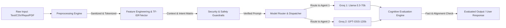

# Project Nexus - AI Research Operating System (Codename: ATHENA)

[](https://github.com/NoTSureSwann/Integrated-Governance-Control)
[](docs/architecture/)
[](https://www.python.org/)

**Project Nexus** (SRS v2.0 - *NEXUS AI OPERATING SYSTEM*) adalah platform *desktop AI Operating System* modular dan terdistribusi berbasis Python & PySide6 (Qt). Project Nexus bukan hanya sekadar chatbot atau AI Assistant, melainkan sebuah **AI Research Operating System** yang mampu mengelola AI Models, Multi-Agent, Knowledge Engine, Dataset, Experiment, Workflow, dan Plugin secara terintegrasi dan aman.

---

## 📜 PROJECT CONSTITUTION

Aplikasi ini mematuhi dan menegakkan **Nexus Constitution** dalam setiap aktivitas logikanya:
1. **Human First** - Prioritaskan keselamatan, otorisasi, dan niat pengguna di atas segalanya.
2. **Safety Before Automation** - Jangan pernah melakukan tindakan destruktif pada sistem secara otomatis.
3. **Evidence Before Conclusion** - Pisahkan FAKTA, ASUMSI, HIPOTESIS, REFERENSI, dan EKSPERIMEN.
4. **Explain Every Decision** - Jelaskan alasan logis setiap keputusan routing model dan penulisan kode.
5. **Modular By Default** - Pastikan komponen terpisah, terkompartemen, dan mudah diganti (*Decoupled & Modular*).
6. **Reproducible Research** - Pastikan log eksperimen cukup kaya untuk mereproduksi hasil riset.
7. **Never Assume Without Evidence** - Hindari kesimpulan terburu-buru tanpa bukti konkret.
8. **Learn Only From Authorized Sources** - Gunakan berkas pengetahuan berizin dan umpan balik tervalidasi.
9. **Preserve User Control** - Selalu tanyakan validasi manual sebelum mengubah sistem.
10. **Improve Continuously** - Integrasikan temuan reviewer dan pengguna untuk perbaikan asisten secara terus-menerus.

---

## 🏛️ ARCHITECTURE DIAGRAM (SRS v2.0 - Hexagonal Micro-Kernel)

Project Nexus mengadopsi kombinasi arsitektur **Micro-Kernel**, **Hexagonal (Ports & Adapters)**, **Event-Driven Bus**, dan **Actor Multi-Agent Model**.

```mermaid
graph TD
    subgraph User Interface Layer
        GUI[PySide6 Desktop GUI / SIGMA Dashboard]
        API[API / Gateway Services]
    end

    subgraph Core Layer (Flat SRS v2.0)
        Kernel[ATHENA AI Kernel / Scheduler]
        Bus[Event Bus / Message Bus]
        Cognitive[Hybrid Cognitive Pipeline]
        Router[Model Router Layer]
    end

    subgraph Adapters & Engines Layer (Ports & Adapters)
        Groq1[Groq Adapter 1: Llama-3.3-70b-versatile]
        Groq2[Groq Adapter 2: OpenAI/GPT-OSS-120b]
        PluginMgr[Plugin Engine / Manager]
        TaskEng[Task Execution Engine]
        DB[SQLite / Persistance DB]
    end

    subgraph Agents Swarm (Multi-Agent Swarm)
        Supervisor[Supervisor Agent]
        Planner[Planner Agent]
        Research[Research Agent]
        Developer[Developer Agent]
        Reviewer[Reviewer Agent]
        Executor[Executor Agent]
    end

    GUI <-->|qasync Event Loop| Bus
    API <-->|REST / WS| Bus
    Bus <--> Kernel
    Kernel <--> Cognitive
    Cognitive <--> Router
    Router <-->|IAgentProvider| Groq1
    Router <-->|IAgentProvider| Groq2
    Kernel <--> PluginMgr
    PluginMgr <--> Agents Swarm
    Kernel <--> TaskEng
    Kernel <--> DB
```

---

## ⚙️ HYBRID COGNITIVE PIPELINE & ALGORITHMS

Setiap masukan dari pengguna atau sistem diproses melalui **Hybrid Cognitive Pipeline** sebelum diteruskan ke LLM, dan luaran LLM dievaluasi kembali sebelum disajikan ke pengguna.



### Algoritma Utama yang Digunakan:
1. **Hybrid Cognitive Preprocessing & Feature Extraction**:
   - **TF-IDF & Cosine Similarity Matrix**: Ekstraksi fitur teks dan identifikasi relevansi konteks repositori/dokumen.
   - **Regex Sanitization & Guardrails**: Pembersihan prompt dari injeksi instruksi berbahaya (*Prompt Injection Guard*).
2. **Actor Model Multi-Agent Orchestration**:
   - Pola siklus supervisi (*Supervisor -> Planner -> Research -> Developer -> Reviewer -> Executor*) berdasar evaluasi skor kepuasan (*Confidence Score* $> 0.85$).
3. **Dynamic Hexagonal Model Routing**:
   - Routing otomatis permintaan ke provider aktif (*Dual Groq Agents*) melalui abstraksi `IAgentProvider`.

---

## 📁 STRUKTUR DIREKTORI UTAMA

```text
nexus/
├── adapters/             # Hexagonal Adapters (LLM Providers: Groq, Kimi, OpenAI)
├── agents/               # Multi-Agent Implementations (Planner, Research, Developer, etc.)
├── api/                  # API Endpoints & Gateway Layer
├── cognitive/            # Hybrid Cognitive Engine (Preprocessing, Feature Eng, Evaluation)
├── connectors/           # External Connectors (GitHub Analyzer, DB Connectors)
├── database/             # SQLite Persistance & Database Manager (nexus.db)
├── docs/                 # Documentation & Architecture Decision Records (ADRs)
│   └── architecture/     # ADR-001, MIS-001, EMC-001 Specification Docs
├── gui/                  # PySide6 Desktop GUI Pages, Widgets, Themes & QSS
├── kernel/               # ATHENA AI Kernel, Scheduler & Task Engine
├── memory/               # Memory Manager (Conversation, Long-Term, CEFR)
├── models/               # Model Router & Model Definitions
├── orchestrator/         # Multi-Agent Workflow Orchestrator
├── plugins/              # Plugin Manager & Plugin Infrastructure
├── ports/                # Hexagonal Interfaces (IAgentProvider, ITaskEngine)
├── tests/                # Unit Testing Suite (PyTest / Unittest)
├── utils/                # Logger, Callbacks & Helper Functions
├── vectorstore/          # Vector Embeddings & Knowledge Engine
├── workflow/             # Workflow Pipeline Execution Engine
├── app/                  # Application Entrypoint (main.py)
├── config.py             # System Configuration & Environment Validator
└── .env                  # Environment Variables (API Keys & Model Specs)
```

---

## 🚀 PANDUAN INSTALASI & MENJALANKAN APLIKASI

### 1. Prasyarat
- Python vers 3.10 atau yang lebih baru.

### 2. Instalasi Dependensi
```bash
pip install -r requirements.txt
```

### 3. Pengaturan `.env`
Buat berkas `.env` di direktori utama dengan konfigurasi Groq Dual-Agent:
```env
GROQ_API_KEY_1=gsk_your_groq_api_key_1_here
GROQ_MODEL_1=llama-3.3-70b-versatile

GROQ_API_KEY_2=gsk_your_groq_api_key_2_here
GROQ_MODEL_2=openai/gpt-oss-120b

MOCK_MODE=False
```

### 4. Eksekusi Unit Test
```bash
python -m unittest discover -s tests
```

### 5. Menjalankan Desktop GUI
```bash
python app/main.py
```

---

## 📄 LISENSI & KONTRIBUSI

Hak cipta dilindungi undang-undang. Diikutsertakan di bawah ketentuan **Project Nexus Governance Control**.
