# Project Nexus - AI Operating System Desktop Dashboard (SIGMA)

Project Nexus adalah sebuah **AI Operating System** modular yang dirancang untuk mendukung riset Artificial Intelligence, rekayasa perangkat lunak (*Software Engineering*), manajemen pengetahuan (*Knowledge Management*), dan pembelajaran Bahasa Inggris CEFR secara terintegrasi. 

Aplikasi ini menggunakan pola arsitektur **MVC/MVVM** modular dengan antarmuka desktop modern berbasis **PySide6 (Qt)** dan loop asinkron asisten AI menggunakan **qasync**.

---

## 📜 PROJECT CONSTITUTION

Aplikasi ini mematuhi dan menegakkan Konstitusi Nexus dalam setiap aktivitas logikanya:
1. **Human First** - Prioritaskan keselamatan, otorisasi, dan niat pengguna di atas segalanya.
2. **Safety Before Automation** - Jangan pernah melakukan tindakan destruktif pada sistem secara otomatis.
3. **Evidence Before Conclusion** - Pisahkan FAKTA, ASUMSI, HIPOTESIS, REFERENSI, dan EKSPERIMEN.
4. **Explain Every Decision** - Jelaskan alasan logis setiap keputusan routing model dan penulisan kode.
5. **Modular By Default** - Pastikan komponen terpisah, terkompartemen, dan mudah diganti.
6. **Reproducible Research** - Pastikan log eksperimen cukup kaya untuk mereproduksi hasil riset.
7. **Never Assume Without Evidence** - Hindari kesimpulan terburu-buru tanpa bukti konkret.
8. **Learn Only From Authorized Sources** - Gunakan berkas pengetahuan berizin dan umpan balik tervalidasi.
9. **Preserve User Control** - Selalu tanyakan validasi manual sebelum mengubah sistem.
10. **Improve Continuously** - Integrasikan temuan reviewer dan pengguna untuk perbaikan asisten secara terus-menerus.

---

## 🧬 ARSITEKTUR LAYOUT & STRUKTUR FOLDER

Proyek ini disusun secara modular untuk membatasi panjang file (maksimum ±300 baris) agar menjaga keterbacaan dan fleksibilitas kode:

```text
project_nexus/
├── app/                  # Main Application Entry Point
│   └── main.py           # Inisialisasi QApplication & Event Loop Asinkron (qasync)
├── database/             # Pengelola Database SQLite Persisten
│   ├── db_manager.py     # Schema tabel nexus.db (Conversations, Knowledge, Research, English)
│   └── nexus.db          # SQLite Database Utama
├── gui/                  # Graphical User Interface Components
│   ├── main_window.py    # Jendela Utama (Sidebar, Toolbar, Bottom Panel, Status Bar)
│   ├── pages/            # Halaman Dashboard, Chat, Research, English, Knowledge, Settings, Plugins
│   ├── widgets/          # Komponen UI Reusable (ChatBubble, LineChart, Sidebar, Toolbar, BottomPanel, RightPanel)
│   ├── router/           # StackedWidget Page Navigation Router
│   └── themes/           # Qt StyleSheet (QSS) untuk Dark & Light Themes
├── memory/               # Pengelola CRUD Memori Asisten AI
│   └── memory_manager.py # Logika Tulis/Baca Memori Percakapan, Jangka Panjang, Riset, & CEFR
├── utils/                # Utilitas & Pustaka Logger Sistem
│   └── logger.py         # Log Callback Registry untuk real-time console streaming ke UI
├── tests/                # Unit Testing Suite
│   └── test_memory_db.py # Pengujian Unit SQLite dan CRUD Memori
├── requirements.txt      # Dependensi Python (PySide6, qasync, qtawesome, rich, groq)
└── .env                  # Variabel Lingkungan (Persistensi Pengaturan API & Model)
```

---

## 📊 DATA ROUTING & PIPELINE FLOW

Bagan di bawah ini menggambarkan alur kerja asinkron dari GUI, worker thread, orkestrator agen, logging callbacks, hingga persistensi memori SQLite:

```mermaid
sequenceDiagram
    autonumber
    actor User
    participant GUI as ChatPage/GUI
    participant Worker as PipelineWorker (QThread)
    participant Agent as NexusOrchestrator
    participant Log as Logger Callbacks
    participant DB as SQLite (nexus.db)

    User->>GUI: Ketik Prompt & Klik Send
    GUI->>DB: Save Message ("user", prompt)
    GUI->>Worker: Start Thread (prompt, mock=config.MOCK_MODE)
    activate Worker
    Worker->>Agent: Exec run_pipeline(prompt)
    activate Agent
    
    rect rgb(30, 30, 40)
        note right of Agent: Multi-agent Cycle (Supervisor -> Planner -> Research -> Developer -> Reviewer)
        Agent->>Log: log_agent_header() / log_agent_output()
        Log-->>GUI: Emit log_received signal
        GUI->>GUI: Update RightPanel (Reasoning) & BottomPanel (Console)
    end

    Agent-->>Worker: Return result (evaluation, history)
    deactivate Agent
    Worker-->>GUI: Emit pipeline_finished signal
    deactivate Worker
    
    GUI->>DB: Save Message ("assistant", evaluation)
    GUI->>GUI: Draw ChatBubble (Agent) & set Progress to 100%
```



---

## 🚀 PANDUAN INSTALASI & MENJALANKAN APLIKASI

### 1. Prasyarat
Pastikan Anda menggunakan Python versi 3.10 atau yang lebih baru.

### 2. Instalasi Dependensi
Jalankan perintah berikut untuk memasang PySide6, qasync, qtawesome, dan library AI lainnya:
```bash
pip install -r requirements.txt
```

### 3. Eksekusi Unit Test
Pastikan seluruh integrasi database dan memori lulus tes mandiri dengan perintah:
```bash
python -m unittest tests/test_memory_db.py
```

### 4. Menjalankan Dashboard Desktop GUI
Jalankan aplikasi desktop dengan perintah:
```bash
python app/main.py
```

---

## 🛡️ FITUR HALAMAN UTAMA

1. **Dashboard Page**: Pemantauan metrik dinamis (CPU/RAM) real-time menggunakan grafik QPainter anti-alias bergradien, tabel log telemetri terbaru, dan status modul.
2. **Chat Page**: Antarmuka gelembung chat (ChatGPT-like) asinkron dengan fitur Copy, Regenerate, dan streaming logs ke panel samping.
3. **Research Page**: Pengunggahan dokumen lokal (PDF/Markdown) serta analisis repositori GitHub terintegrasi dengan logs real-time.
4. **English Trainer Page**: Dashboard kemajuan CEFR dinamis (Vocabulary, Grammar, Writing) dan checker tata bahasa dengan AI tutor.
5. **Knowledge Wiki Page**: Mesin pencarian basis pengetahuan internal bersistem list-detail splitter dan popup dialog penambahan konsep.
6. **Plugins Manager**: Panel kontrol status koneksi untuk 8 tipe database/connector (PostgreSQL, Docker, ChromaDB, dll).
7. **Settings Manager**: Mengatur API Keys, Pilihan Model LLM, sakelar simulasi offline (Mock Mode), dan menyimpannya langsung ke `.env`.
