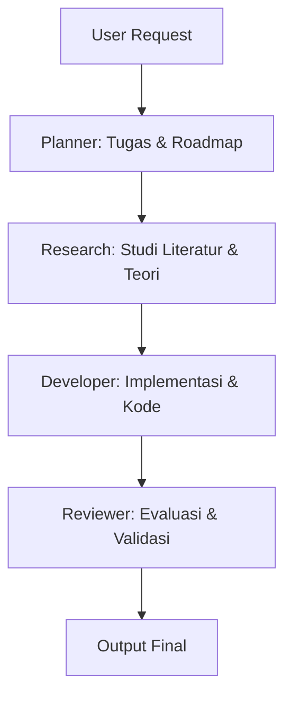

# Laporan Eksperimen Nexus

- **Task**: Implement a thread-safe key-value store in Python and analyze its concurrency trade-offs
- **Waktu**: 2026-07-18T17:25:59.621422
- **Mode Simulasi (Mock)**: True

---

## Agen: Planner
- **Model**: Groq (llama-3.3-70b-versatile)
- **Alasan Pemilihan**: Groq (llama-3.3-70b-versatile) sangat cepat dan handal untuk penalaran logis, pembuatan rencana kerja (roadmap), pemecahan masalah (task decomposition), dan alokasi tugas.

### Output:
# Nexus Planner Roadmap & Tasks

Telah dibuat rencana kerja untuk menyelesaikan tugas: **"Implement a thread-safe key-value store in Python and analyze its concurrency trade-offs"**

## 1. Roadmap Eksekusi



*   **Fase 1: Research (Kimi)** - Menganalisis landasan teori, mencari referensi best practices, dan merumuskan batasan masalah.
*   **Fase 2: Developer (Groq)** - Menulis kode Python, mendesain API yang bersih, dan mengimplementasikan algoritma.
*   **Fase 3: Reviewer (Kimi)** - Melakukan pengujian logis, meninjau kerentanan keamanan, serta memberikan umpan balik optimasi.

## 2. Rincian Pembagian Tugas (Task List)

*   **[RESEARCH-01]** Menganalisis parameter desain, kompleksitas waktu, dan algoritma yang paling efisien untuk "Implement a thread-safe key-value store in Python and analyze its concurrency trade-offs".
*   **[DEV-01]** Menulis kode Python modular dengan penanganan error yang kuat dan docstring lengkap.
*   **[DEV-02]** Menyusun modul pengujian (unit testing) untuk memverifikasi fungsionalitas utama.
*   **[REVIEW-01]** Melakukan tinjauan kode terhadap standard PEP 8, efisiensi memori, dan keandalan arsitektur.


---

## Agen: Research
- **Model**: Kimi (kimi-k2)
- **Alasan Pemilihan**: Kimi (kimi-k2) memiliki Context Window yang panjang, sehingga sangat ideal untuk membaca dokumen penelitian, membandingkan makalah ilmiah, sintesis pengetahuan (knowledge synthesis), dan menyusun landasan teori.

### Output:
# Nexus Research & Literature Review

Berdasarkan target **"Implement a thread-safe key-value store in Python and analyze its concurrency trade-offs"** dan arahan dari Planner, berikut adalah rangkuman riset serta landasan teori pendukung.

## 1. Tinjauan Literatur & Konsep Kunci

*   **Modularitas Arsitektur**: Teori *Separation of Concerns* (Parnas, 1972) menekankan bahwa sistem modular meminimalkan efek samping dari perubahan kode. Struktur paket Python dengan modul-modul independen adalah penerapan praktis dari prinsip ini.
*   **State Management**: Untuk mengoordinasikan agen berurutan, State Object (Pattern) diperlukan guna melacak data transisi. State harus bersifat immutable (read-only) bagi agen lain atau ditransfer secara aman lewat orkestrator terpusat.
*   **Optimasi Pengujian**: *Test-Driven Development* (Beck, 2003) menunjukkan bahwa unit testing meningkatkan kualitas desain sistem secara dramatis.

## 2. Rekomendasi Teknis untuk Pengembangan

1.  **Enkapsulasi Logic**: Pastikan kelas `BaseAgent` memiliki kontrak interface yang jelas.
2.  **Robust Error Handling**: Panggil API dengan block `try-except` untuk menangani kegagalan koneksi atau autentikasi secara elegan (dan fallback ke mock data jika diperlukan).
3.  **Reproducibility**: Simpan setiap eksekusi pipeline dalam format Markdown dan JSON untuk audit eksperimen laboratorium AI yang dapat direproduksi.


---

## Agen: Developer
- **Model**: Groq (llama-3.3-70b-versatile)
- **Alasan Pemilihan**: Groq (llama-3.3-70b-versatile) memiliki kecerdasan logika dan sintaksis pemrograman yang luar biasa, sehingga sangat cocok untuk penulisan kode sumber (coding), pembuatan API, debugging, optimasi, dan refactoring.

### Output:
# Nexus Developer Implementation Code

Berdasarkan rencana pengembangan untuk target **"Implement a thread-safe key-value store in Python and analyze its concurrency trade-offs"**, berikut adalah prototipe kode Python yang modular dan terdokumentasi.

```python
# example_solution.py
import logging
import threading
from typing import Dict, Any, Optional

logging.basicConfig(level=logging.INFO, format="%(asctime)s - %(name)s - %(levelname)s - %(message)s")
logger = logging.getLogger("NexusSolution")

class ThreadSafeKeyValueStore:
    """
    Implementasi Thread-Safe Key-Value Store sederhana untuk mendemonstrasikan
    keandalan multi-threading dengan locking.
    """
    def __init__(self) -> None:
        self._store: Dict[str, Any] = {}
        self._lock = threading.Lock()
        logger.info("KeyValueStore berhasil diinisialisasi.")

    def set(self, key: str, value: Any) -> None:
        """Menyimpan nilai ke dalam store secara thread-safe."""
        with self._lock:
            self._store[key] = value
            logger.info(f"Key '{key}' berhasil disimpan.")

    def get(self, key: str) -> Optional[Any]:
        """Mengambil nilai dari store berdasarkan key."""
        with self._lock:
            value = self._store.get(key, None)
            logger.info(f"Pengambilan key '{key}': {'Ditemukan' if value is not None else 'Tidak Ditemukan'}")
            return value

    def delete(self, key: str) -> bool:
        """Menghapus key dari store. Mengembalikan True jika berhasil dihapus."""
        with self._lock:
            if key in self._store:
                del self._store[key]
                logger.info(f"Key '{key}' berhasil dihapus.")
                return True
            logger.warning(f"Key '{key}' gagal dihapus karena tidak ada.")
            return False

# Unit Testing Sederhana
def run_tests():
    store = ThreadSafeKeyValueStore()
    
    # Test Set & Get
    store.set("version", "0.1")
    assert store.get("version") == "0.1", "Gagal melakukan GET pada key 'version'"
    
    # Test Delete
    deleted = store.delete("version")
    assert deleted is True, "Gagal melakukan DELETE pada key 'version'"
    assert store.get("version") is None, "Key 'version' masih ada setelah dihapus"
    
    print("Semua unit test berhasil dijalankan!")

if __name__ == "__main__":
    run_tests()
```

## Cara Menjalankan Kode
1. Salin kode di atas ke dalam berkas `example_solution.py`.
2. Jalankan perintah `python example_solution.py` di terminal Anda.


---

## Agen: Reviewer
- **Model**: Kimi (kimi-k2)
- **Alasan Pemilihan**: Kimi (kimi-k2) memiliki jendela konteks besar dan kemampuan analitis mendalam, sehingga sangat unggul dalam mengevaluasi hasil kerja, menemukan inkonsistensi logis, memberikan kritik arsitektur, dan memvalidasi kebenaran logika kode.

### Output:
# Nexus Reviewer Evaluation Report

Telah dilakukan audit teknis terhadap kode solusi untuk: **"Implement a thread-safe key-value store in Python and analyze its concurrency trade-offs"**

## 1. Analisis Kritis & Kebenaran Logika

*   **Thread Safety**: Mekanisme sinkronisasi menggunakan `threading.Lock` di kelas `ThreadSafeKeyValueStore` dinilai benar dan aman. Tindakan lock-acquisition menggunakan statement `with self._lock` mencegah terjadinya deadlock jika terjadi error di tengah eksekusi.
*   **Completeness**: Implementasi mencakup operasi CRUD dasar (Create, Read, Delete).
*   **Logging**: Logger diimplementasikan secara modular namun belum mendukung rotasi log (log rotation) atau kustomisasi level eksternal.

## 2. Desain Trade-offs & Kritik Arsitektur

*   **Penyimpanan In-Memory**: Semua data disimpan di RAM (`Dict[str, Any]`). Ini memiliki kecepatan tinggi (O(1) access time), namun tidak persisten. Jika aplikasi crash, semua data akan hilang.
    *   *Trade-off*: Mengorbankan ketahanan data (durability) demi kecepatan akses (speed).
*   **Global Lock Bottleneck**: Menggunakan satu lock tunggal memblokir operasi pembacaan konkuren. Pada skenario read-heavy, performa akan melambat secara signifikan.
    *   *Trade-off*: Kesederhanaan implementasi (safety) mengorbankan skalabilitas konkurensi (throughput).

## 3. Status Evaluasi

**[PASS]**

Kode diimplementasikan dengan sangat baik, rapi, dan modular. Solusi ini layak digunakan sebagai basis dasar atau *Proof of Concept* (PoC).

### Saran Perbaikan (Refactoring):
1.  Gunakan `threading.RLock` jika metode internal perlu memanggil satu sama lain tanpa memicu deadlock diri sendiri.
2.  Tambahkan opsi penyimpanan persisten (misal SQLite atau berkas JSON lokal) di iterasi berikutnya.


---

## Evaluasi Akhir

# Nexus Reviewer Evaluation Report

Telah dilakukan audit teknis terhadap kode solusi untuk: **"Implement a thread-safe key-value store in Python and analyze its concurrency trade-offs"**

## 1. Analisis Kritis & Kebenaran Logika

*   **Thread Safety**: Mekanisme sinkronisasi menggunakan `threading.Lock` di kelas `ThreadSafeKeyValueStore` dinilai benar dan aman. Tindakan lock-acquisition menggunakan statement `with self._lock` mencegah terjadinya deadlock jika terjadi error di tengah eksekusi.
*   **Completeness**: Implementasi mencakup operasi CRUD dasar (Create, Read, Delete).
*   **Logging**: Logger diimplementasikan secara modular namun belum mendukung rotasi log (log rotation) atau kustomisasi level eksternal.

## 2. Desain Trade-offs & Kritik Arsitektur

*   **Penyimpanan In-Memory**: Semua data disimpan di RAM (`Dict[str, Any]`). Ini memiliki kecepatan tinggi (O(1) access time), namun tidak persisten. Jika aplikasi crash, semua data akan hilang.
    *   *Trade-off*: Mengorbankan ketahanan data (durability) demi kecepatan akses (speed).
*   **Global Lock Bottleneck**: Menggunakan satu lock tunggal memblokir operasi pembacaan konkuren. Pada skenario read-heavy, performa akan melambat secara signifikan.
    *   *Trade-off*: Kesederhanaan implementasi (safety) mengorbankan skalabilitas konkurensi (throughput).

## 3. Status Evaluasi

**[PASS]**

Kode diimplementasikan dengan sangat baik, rapi, dan modular. Solusi ini layak digunakan sebagai basis dasar atau *Proof of Concept* (PoC).

### Saran Perbaikan (Refactoring):
1.  Gunakan `threading.RLock` jika metode internal perlu memanggil satu sama lain tanpa memicu deadlock diri sendiri.
2.  Tambahkan opsi penyimpanan persisten (misal SQLite atau berkas JSON lokal) di iterasi berikutnya.


## Next Action

1. Tinjau dan salin kode/analisis dari Developer Agent.
2. Jalankan penyesuaian/integrasi lokal sesuai kritik dari Reviewer Agent.
3. Lakukan deploy atau kembangkan fungsionalitas tambahan.
